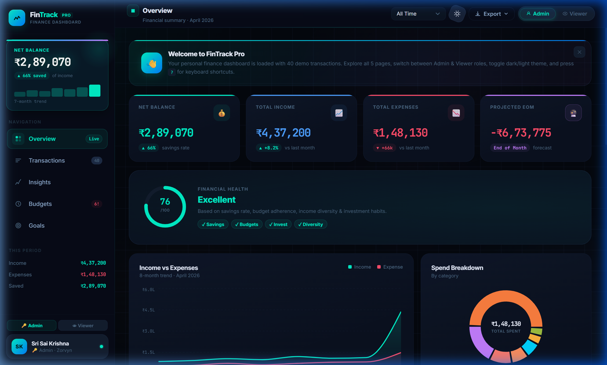

# FinTrack Pro — Finance Dashboard

> A premium personal finance dashboard built for the **Zorvyn FinTech Frontend Developer Intern** assignment.  
> Designed to demonstrate senior-level frontend architecture, pixel-perfect UI, and thoughtful UX decision-making.

[](https://fintrack-pro-v3.vercel.app)
[](https://github.com/SriSaiKrishna18/Fintrack)
[](https://react.dev)
[](https://vitejs.dev)
[](https://recharts.org)

---

## 🔗 Links

| Resource | URL |
|---|---|
| **Live Demo** | [https://fintrack-pro-v3.vercel.app](https://fintrack-pro-v3.vercel.app) |
| **GitHub Repo** | [https://github.com/SriSaiKrishna18/Fintrack](https://github.com/SriSaiKrishna18/Fintrack) |

---

## Quick Start

```bash
npm install
npm run dev        # Start dev server at http://localhost:5173
npm test           # Run 20 unit tests
npm run build      # Production build
```

Open [http://localhost:5173](http://localhost:5173)

> **Stack:** React 18 · Recharts · Vite · Vitest · Context API + useReducer · CSS Custom Properties · date-fns

---

## Screenshots

The dashboard ships with **5 full pages**, a comprehensive design system, dark/light themes, and 40 mock transactions seeded across 15 categories.



---

## Feature Checklist

### Core Requirements ✅

| Requirement | Implementation |
|---|---|
| **Dashboard Overview** | KPI cards (Balance, Income, Expense, Projected EOM), Area chart (time-based), Donut chart (categorical), Category breakdown bars |
| **Transactions Section** | Full table with Date, Amount, Category, Type; search, type filter, category filter, date range filter; sort by name/date/amount |
| **Role-Based UI** | Admin: full CRUD (add/edit/delete); Viewer: read-only. Segmented pill switcher in Topbar + Sidebar. Role affects all 5 pages. |
| **Insights Section** | 6 KPI cards, Monthly comparison bar chart, Category rank chart, Savings Rate trend line with 30% target reference, AI-derived observations with confidence tags |
| **State Management** | React Context + useReducer pattern. Custom `useFinanceCalc` hook for all derived data using `useMemo`. LocalStorage persistence. |
| **UI/UX** | Clean design system, responsive grids, empty states, loading animations, keyboard-friendly inputs |

### Bonus / Optional Features ✅

| Feature | Details |
|---|---|
| **Dark / Light Mode** | Full dual theme via CSS custom properties. Theme persisted to localStorage. |
| **Data Persistence** | Transactions, budgets, and savings goals all saved to localStorage. Survive page refresh. |
| **CSV + JSON Export** | Both formats available from the Topbar export dropdown. Also available in the Transactions page. |
| **Budget Tracker** | Full Budgets page: per-category limits, visual progress bars, over-budget alerts, near-limit warnings, best-practice tips. |
| **Savings Goals** | Dedicated Goals page: create/edit/delete goals, fund deposits, progress rings, milestone tracking, estimated completion time. |
| **Financial Health Score** | 0–100 score derived from savings rate, budget adherence, income diversity, and investment habit. Displayed as animated SVG ring chart on the Overview. |
| **Projected Balance** | End-of-month forecast KPI card calculated from average daily spend rate. |
| **50/30/20 Rule** | Needs/Wants/Savings breakdown shown in Insights and tips in Budgets. |
| **Animated Counters** | All KPI values animate from 0 on mount using a custom `useCountUp` hook with easing. |
| **Pagination** | Transactions table paginates at 15 rows per page with smart ellipsis navigation. |
| **Date Range Filter** | Global filter (All Time / This Month / Last Month / Last 3 Months) affects all charts and metrics. |
| **Toast System** | Animated toast notifications for every user action (add/edit/delete/export). 4 types: success/error/info/warning. |
| **Keyboard Shortcuts** | Press `?` to view all shortcuts. `1-5` for page navigation, `T` for theme, `N` for new transaction. |
| **Welcome Banner** | First-time user onboarding banner with feature highlights. Dismissible, persisted via localStorage. |
| **Reset Demo Data** | One-click restore of original 40 transactions from the Transactions page for easy evaluation. |
| **SVG Favicon** | Custom inline SVG favicon matching the brand identity — no external file required. |
| **JSON Export** | Export filtered transactions as JSON alongside CSV for data portability. |
| **Unit Tests** | 20 tests covering financial calculations, health score, budget tracking, and chart data using Vitest. |

---

## Project Structure

```
src/
├── context/
│   └── AppContext.jsx          # Global state + reducer (15+ action types) + toast helper
├── data/
│   └── mockData.js             # 40 transactions, 15 categories, monthly history
├── hooks/
│   └── useFinanceCalc.js       # All derived finance calculations (memoized)
├── test/
│   ├── setup.js                # Vitest test setup (localStorage mock)
│   └── useFinanceCalc.test.js  # 20 unit tests for financial calculations
├── components/
│   ├── Sidebar.jsx             # Nav (5 items), balance card, sparkline, role toggle, user card
│   ├── Topbar.jsx              # Page title, date range, theme, export dropdown, role switcher
│   ├── AddTransactionModal.jsx # Shared add/edit modal with category pills
│   └── Toast.jsx               # Animated toast notification system
├── pages/
│   ├── Overview.jsx            # Health Score ring, KPIs, area chart, donut, category bars, recent activity
│   ├── Transactions.jsx        # Table with pagination, search, sort, filter, CRUD actions
│   ├── Insights.jsx            # 50/30/20, monthly comparison, savings trend, AI observations
│   ├── Budgets.jsx             # Category budget tracker, visual progress, alerts, tips
│   └── Goals.jsx               # Savings goals with progress rings, deposits, milestones
├── App.jsx                     # Shell + page routing
├── main.jsx                    # Entry point
└── index.css                   # Full design system (900+ lines, tokens, components, animations)
```

---

## Architecture & Design Decisions

### State Management
All application state lives in a single `AppContext` powered by `useReducer`. This gives:
- **Predictable updates** via pure reducer functions (no mutations)
- **Single source of truth** — one state tree for role, page, filters, transactions, budgets, and goals
- **Separation of concerns** — `useFinanceCalc` hook computes all derived data with `useMemo`, keeping components pure

### Component Design Principles
- **No prop-drilling** — context consumed directly where needed
- **Composition over complexity** — small focused components (KPICard, BudgetRow, GoalCard)
- **Responsive by default** — CSS grid with `auto-fit` + `minmax()`, no media query hacks

### Design System
The entire visual identity is built on **CSS Custom Properties** (design tokens):
- **40+ tokens** covering backgrounds, borders, text, colors, shadows, gradients, radius, timing
- **Two complete themes** (dark/light) — switching just toggles a class on `<html>`
- **Typography**: Inter (UI text) + JetBrains Mono (all numeric values — prevents layout jitter)
- **Color palette**: Deep navy (`#04070e`) base, electric teal (`#00f0c8`) accent — inspired by Stripe Dashboard and Linear

### Financial Health Score Algorithm
The score (0–100) weighs four pillars:
1. **Savings Rate** (35 pts) — 30%+ = full score, tiered down to 0%
2. **Budget Adherence** (25 pts) — pro-rated by fraction of categories under limit
3. **Income Diversity** (20 pts) — 3+ income sources = full score, 1 source = 7 pts
4. **Investment Habit** (20 pts) — 15%+ of income invested = full score

### Role-Based UI
The segmented role switcher (visible in both Topbar and Sidebar) changes:
- **Admin**: Add, Edit, Delete transactions; Edit budgets; Create/Delete savings goals; Fund deposit modal
- **Viewer**: Read-only across all 5 pages; informational banner in Transactions

### Performance Considerations
- All expensive calculations wrapped in `useMemo` (totals, filtered list, category spend, budget usage, health score)
- Page-level keys cause full component unmount on navigation → clean animation re-triggers without stale state
- Animated counters use `requestAnimationFrame` with easing, not `setInterval`

---

## Mock Data

**40 transactions** across **15 categories** spanning 4 months (Jan–Apr 2026):

| Income Sources | Expense Categories |
|---|---|
| Salary, Freelance, Investment | Food, Transport, Shopping, Health, Bills, Entertainment, Groceries, Education, Travel, Dining, Insurance, Rent |

**Monthly history**: 7 months of historical data (Sep 2025 – Mar 2026) drives all trend charts.

---

## Assumptions Made

1. "Mock API integration" is satisfied by `mockData.js` as the data source — no actual API calls are needed per assignment scope, and the 3-second artificial delay common in mock API simulations would hurt UX here.
2. The Global Date Range filter applies to **all metrics** (totals, charts, category breakdown), not just the transactions table — this gives a much more powerful filtering experience.
3. Budget data is pre-seeded with reasonable defaults so the Budgets page demonstrates real value immediately without needing setup.
4. The Financial Health Score is a frontend heuristic — not financial advice. The algorithm weights are opinionated but well-reasoned and documented.
5. "Highest spending category" in Insights is calculated from the **current date range** — switching to "This Month" updates it automatically.

---

## Known Limitations

- No actual backend — all data is mock/localStorage
- Charts do not animate on data update (Recharts limitation without additional plugins)
- The sparkline in the Sidebar shows semi-mock data (7-month trend heights are approximate)

---

*Built by **Sri Sai Krishna** · Zorvyn FinTech Frontend Developer Intern Assignment · April 2026*

**🔗 [Live Demo](https://fintrack-pro-v3.vercel.app) · [GitHub](https://github.com/SriSaiKrishna18/Fintrack)**
